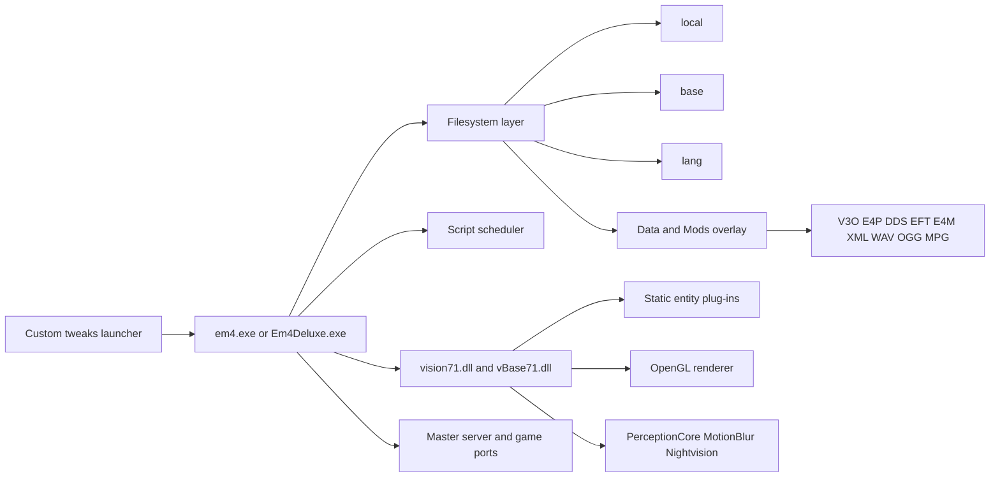
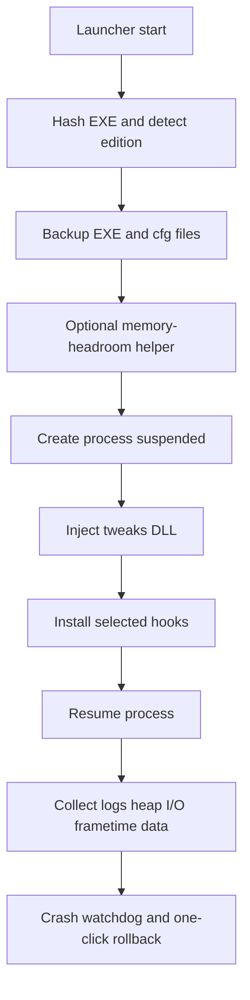

# Emergency 4 Deluxe and 911 First Responders Technical Tweaks Report

## Executive summary

Emergency 4 Deluxe and 911: First Responders are best understood as a legacy Windows game built on a Trinigy Vision 7.1-era runtime, with the retail/Steam build exposing `vision71.dll`, `vBase71.dll`, a script scheduler, a layered filesystem (`local`, `base`, `lang`), static entity plug-ins, and an OpenGL renderer that checks for extensions such as `GL_ARB_multitexture` and optionally enables a faster geometry-memory path when VBO support is present. The Steam release still targets the design assumptions of Windows 2000/XP-era, single-core hardware, even though it now runs on modern Windows systems. SteamDB also shows that the Steam depots have had no public binary/content update since July 2020, which is good news for version-hash-based hook maintenance. citeturn27view0turn11view0turn20view0turn21view0

The public evidence base is unusually consistent about the problems users still want fixed: black-screen/instant-exit startup failures, codec-triggered crashes before intro videos, fullscreen and alt-tab instability on Windows 10/11, stretched or broken widescreen behavior, AMD-driver-specific black screens or graphical corruption, severe FPS collapse around lit or selected vehicles, long synchronous load times, recurring memory-related crashes that motivated community “4 GB” patchers, and brittle multiplayer setup that still often depends on port forwarding or VPN tools such as Hamachi. Those are exactly the kinds of issues a custom launcher plus injected DLL can address, because most sit at the boundaries between the game and the OS or driver stack: window/display mode management, media playback, file I/O, heap telemetry, OpenGL state churn, and network diagnostics. citeturn29search1turn29search3turn17search0turn18search8turn17search2turn43view0turn37search4turn39search1turn38view0turn31search0turn31search1turn19search4turn18search0

The highest-return tweak path is not “rewrite the engine.” It is a staged compatibility and performance program: first, early-process injection, logging, video bypass, borderless/windowed-fullscreen handling, config normalization, and memory/file-I/O telemetry; second, cold-load prefetching, targeted allocator work, and render hot-path optimization around shadows, lights, and selected-vehicle previews; third, only after profiling, deeper work on route-finding frequency, asset residency heuristics, and multiplayer quality-of-life shims. A DLL-only approach can deliver meaningful wins, but full texture streaming, true simulation multithreading, or a robust rewrite of traffic/pathfinding behavior are all high-risk because the public evidence points to hardcoded engine behavior rather than script-level logic. citeturn27view0turn15view0turn37search6turn42view0turn39search6

| Recommended priority | Why it should come first | Why it fits DLL injection |
|---|---|---|
| Startup movie bypass and media shim | Repeated startup crashes point to fragile video/filter initialization and codec conflicts before gameplay begins. citeturn29search1turn29search3turn29search2turn10search1 | Easy to intercept early and low risk to gameplay logic. |
| Borderless/fullscreen/alt-tab fixes | Alt-tab failure and fullscreen oddities are still actively reported in 2024–2025. citeturn17search0turn16search3turn18search8 | Pure window-management QoL, minimal simulation risk. |
| File-I/O telemetry plus cold-load prefetch | The game loads many thousands of mostly small assets, and users report first-load pain worsened by antivirus scanning and packed assets. citeturn21view0turn23view1turn38view0turn42view0 | Strong fit for API hooks around file opens and reads. |
| Heap telemetry and memory-headroom helper | Memory-related crashes are common enough that public patchers are widely circulated. citeturn30search0turn31search0turn31search1turn32view0 | Hooking allocators is feasible; address-space expansion may require an external helper rather than pure DLL logic. |
| Render hot-path profiling around lights and selection | Community fixes repeatedly target shadows and `e4_mbfastcopy`, and selected/lit vehicles are a recurring FPS trigger. citeturn15view0turn37search4turn39search1turn39search3turn39search8 | Good candidate for selective hooks once hot functions are identified. |

## What the public evidence says about the runtime

Public artifacts let you say more about EM4/911FR than most old games, but not everything. The game’s own log output shows the startup chain registering filesystem devices `local`, `base`, and `lang`, then initializing a script scheduler, loading `vision71.dll`, enumerating static entity plug-ins such as `VisObject3D_cl`, `GameEntity_cl`, and `Emitter_cl`, allocating Vision-core memory for polygon chunks and entities, creating post-processors (`PerceptionCore`, `MotionBlur`, `Nightvision`), and finally starting an OpenGL renderer. The same log proves that the Windows renderer depends on OpenGL extensions, with hard failure when `GL_ARB_multitexture` is unavailable and a “fast geometry memory” path disabled when VBO support is missing. That is the clearest public signal that the shipping game is a heavily customized Vision 7.1-era OpenGL title, but exact build choices inside the proprietary game layer remain unknown without local binary analysis. citeturn27view0turn6search0turn6search1

The asset layout also points to the game’s practical architecture. SteamDB’s content depot lists roughly 15,011 files totaling about 1.42 GiB, including 3,866 `V3O` models, 4,295 `e4p` prototypes, 4,670 `dds` textures, 29 `e4m` maps, 29 `eft` files, 134 `script` files, 24 `pscript` files, 454 `xml` files, 351 `wav`, 31 `ogg`, and 31 `mpg` files. Hoppah’s long-running EM4 documentation explains the core object triad of `E4P` prototype, `V3O` model, and `DDS` texture, while EM-Hub’s EFTXplorer notes that `EFT` is a proprietary texture-compression format used for important textures. Collectively, that means EM4 is not a monolithic data blob: it is a many-file, file-extension-driven runtime whose load behavior can be influenced significantly by file-system overhead, decompression, and path redirection. citeturn21view0turn23view1turn12search0turn40search0

The game’s modding and editor behavior further clarifies resource loading. Community documentation states that the base `Data` folder is loaded first and a single active mod then overlays or replaces matching assets from its own folder tree. The Steam store explicitly lists an included level editor, and community guidance says the editor can be launched with `-editor` and that an “Editor Manual” PDF is shipped with the installation. For a tweaker, this matters because the same overlay logic that makes mods work also makes asset-path interception straightforward: even without touching mod content, a DLL can watch or redirect file accesses across `Data`, `Mods`, `Lang`, and `Specs`. citeturn12search0turn11view0turn44search2turn44search4turn44search8

Scripting is present, but it is not a managed-language runtime in the modern sense. Public tutorials show C-like EM4 source files in `Scripts/Game/Command`, with syntax such as `const char CAR_01[] = "mod:Prototypes/...";` and command bindings like `VCmdSiren`; community posts in 2025 also distinguish readable `.script` files from packed or compiled `.pScript` content. That strongly suggests a native engine plus game-specific scripting layer, not a garbage-collected managed VM exposed in the usual way. In other words, there is no public basis for “GC tuning” as an optimization strategy; the likely levers are heap behavior, file loading, simulation update frequency, and render work. citeturn13search2turn41search0turn20view0

Networking is limited but real. The Steam store lists online PvP and online co-op, and community support documentation names the ports commonly needed for multiplayer: TCP 58282, UDP 12345, and port 80. Community config examples also expose `game_server_port`, `master_server_addr`, `master_server_port`, and `match_making_port`, while current users still ask how to host and are often told to use Hamachi or similar tools. The practical inference is that multiplayer is legacy host/discovery networking with poor NAT friendliness, not a modern relay-backed service. citeturn11view0turn19search4turn39search6turn18search0turn19search11

The one subsystem that remains more ambiguous is threading. Trinigy’s own Vision 7 publicity talked about multi-threading optimizations at the engine level, but EM4’s published requirements still target single-core CPUs, and community performance/stability advice has long included forcing the game onto one core. That does not prove the shipping build is literally single-threaded, but it is enough to treat it as effectively main-thread-bound and timing-sensitive until your own profiler proves otherwise. citeturn6search0turn6search1turn11view0turn15view0turn14search2

| Subsystem | What can be stated with confidence | Why it matters for hooks |
|---|---|---|
| Engine lineage | `vision71.dll`, `vBase71.dll`, and `Vision(TM), Version PC-4, 7, 28, 0` appear in logs, matching a Vision 7.1-era lineage. citeturn27view0turn20view0turn6search0 | Version-aware hooks should target the EXE plus Vision DLL boundaries. |
| Rendering | Windows build uses OpenGL; missing `GL_ARB_multitexture` causes failure; VBO support enables a faster geometry-memory path. citeturn27view0 | Excellent candidates: GL context hooks, state-change tracing, hot-path render analysis. |
| Audio and video assets | Depot contains `wav`, `ogg`, and `mpg`; startup failures mention `VVideoTexture::InitTextureRenderer()` and codec/filter problems. citeturn21view0turn29search1turn29search3 | Media playback can likely be bypassed or shimmed without touching gameplay. |
| Scripts and specs | Depot contains `script`, `pscript`, and `xml`; tutorials show C-like command scripts and `Specs` data. citeturn23view1turn13search2turn12search0 | Good for diagnostics and for avoiding mistaken attempts to patch hardcoded behavior in script space. |
| Resource loading | Data-first plus one-mod overlay model; many-file asset set with packed/unpacked support. citeturn12search0turn42view0turn21view0 | File-system hooks, prefetch, and cache warming are high-probability wins. |
| Config surface | Community config examples expose `fs_*`, `r_*`, `ph_*`, `e4_mbfastcopy`, `e4_maxvideotextures`, network ports, and `p_showfps`. citeturn39search6turn25search16 | A launcher can normalize settings before the first frame. |

## What users still want fixed

The community’s runtime complaints are now remarkably stable, and they cluster around a small number of engine/OS seams rather than around game design. Startup compatibility is the most obvious category. Users repeatedly report black-screen exits before the intro or before any video plays, and the public log record points to two distinct causes: OpenGL context/driver failures, and a brittle video-texture path that trips over codecs or DirectShow-style filters. One recurring error is `VVideoTexture::InitTextureRenderer(): failed to add source filter [80040241]`; another long-running fix pattern is uninstalling K-Lite/LAV-style codec packs to make the game launch again. This strongly argues for a startup shim that either bypasses movie playback completely or replaces it with a much narrower, self-contained path. citeturn27view0turn29search1turn29search3turn29search2turn10search1

Display and modern-desktop integration are the next major pain point. Users in 2023–2025 still report broken fullscreen behavior, alt-tab crashes, weird scaling, partial-screen rendering on Windows 11, black preview panes, and missing overlays. EM-Hub’s modern support notes still recommend disabling fullscreen optimizations and running as administrator, while a 2024–2025 Steam thread shows that even after trying those mitigations, some users still lose the game when alt-tabbing and fall back to setting `r_fullscreen` to `0`. Community guidance about widescreen is equally blunt: you can edit `em4.cfg`, but the game was built around 4:3 assumptions and 16:9 often stretches or crops. That is exactly the territory where a borderless-window shim, cursor capture modes, and optional camera-key remapping can do more than config edits alone. citeturn16search3turn17search0turn18search8turn17search1turn25search7turn25search6

Performance complaints are less random than they first look. Users regularly point at shadows, lights, and the moment a vehicle is selected or starts moving as the trigger for catastrophic frame drops. In one support thread, the recommended fixes are lowering shadow settings or even forcing single-core affinity; in several others, changing `<var name="e4_mbfastcopy" value="1" />` to `0` is reported to reduce lag, especially on AMD systems or in scenes with many active lights. A recent EM-Hub support answer still gives the same `e4_mbfastcopy=0` guidance. That does not prove the root cause, but it does tell you where to look first: copy paths, selected-vehicle preview updates, light/shadow state churn, and renderer branches that behave badly on newer drivers. citeturn15view0turn37search4turn39search1turn39search3turn39search8

Modern GPU-driver sensitivity is also real. Steam users with AMD cards reported black screens after maps loaded following Radeon driver changes in 2022; a 2023 support thread documented severe graphical glitches on RX 580-class hardware after driver updates, and later posts in the same thread said newer AMD drivers fixed the issue. That pattern is classic for a legacy OpenGL title that relies on behaviors modern drivers no longer handle consistently. A DLL layer that can disable or reroute fragile render paths on specific vendors would therefore be much more valuable than blanket “graphics down” advice. citeturn17search2turn43view0

Load time behavior points to synchronous asset work. A 2009 support thread describes first-load times ranging from 5 to 30 minutes until real-time antivirus scanning was disabled, after which loading became “flawless.” Separately, the EM4 Packer Utility documentation explains that EM4 can use packed/compressed `.dds` and `.script` files, but the first load of a fully packed test mod took about 22% longer and freeplay about 32% longer in the author’s measurements, with later loads helped by caching. When you combine those reports with SteamDB’s count of many thousands of asset files, the likely diagnosis is straightforward: the engine is spending a lot of time in synchronous file opens, small reads, decompression, and cache misses. That makes a prefetcher, a memory-mapped asset cache, or at least aggressive OS-cache warming highly plausible as useful tweaks. citeturn38view0turn42view0turn21view0

Memory pressure is the last major class, and it is one of the clearest areas of current demand. Community members explicitly describe a “memory bleed” or progressive resource exhaustion, and public patch tools now exist specifically to increase the game’s usable memory headroom and reduce memory-related crashes. EM-Hub’s installation guidance for the patch remained active in 2025, and forum posts in 2024–2025 still recommend it as a stability prerequisite. Even if some of the community patchers are imperfect or oversold, the demand signal is beyond doubt: users are still hitting an address-space or allocation-stability ceiling that they want removed. citeturn30search0turn31search0turn31search1turn31search11turn30search3

AI and routing also show a stable pattern. Public community explanations describe EM4 vehicle movement as a simple route search on the “streets” system that does not examine traffic amounts and becomes clunky around civilian vehicles; other discussions describe pathfinding and parking scripts needing auxiliary “streets” or virtual blockers to behave acceptably. This is community reverse-engineering, not official documentation, so it should be treated carefully. Even so, it is consistent with what players complain about: slow, brittle traffic interactions, awkward detours, and poor behavior around trailers or large vehicles. The implication is not “rewrite the pathfinder first,” but rather “treat pathfinding changes as deep surgery, and prefer throttling, caching, or smarter dispatch heuristics before trying to replace core logic.” citeturn37search6turn37search5turn37search3

| Repeating user complaint | Evidence in the sources | Most likely locus | Injection relevance |
|---|---|---|---|
| Black screen or instant exit before intro | Codec/filter errors and startup crash reports; OpenGL extension failures in logs. citeturn29search1turn29search3turn27view0 | Media graph plus GL startup | Very high |
| Alt-tab and fullscreen breakage | Active 2024–2025 threads plus modern fullscreen-optimization workaround notes. citeturn17search0turn16search3turn18search8 | Window/display-mode management | Very high |
| Widescreen still feels hacked-in | `em4.cfg` edits work partially, but aspect handling remains 4:3-centric. citeturn17search1turn25search6turn25search7 | Windowing and UI assumptions | High |
| GPU-driver-specific black screens or glitches | AMD reports in 2022–2023; later driver fixes. citeturn17search2turn43view0 | Fragile legacy OpenGL paths | High |
| Vehicle-selection and emergency-light FPS collapse | Repeated reports plus `e4_mbfastcopy=0` workaround. citeturn37search4turn39search1turn39search3 | Render hot path around selection/lights/shadows | High |
| Long first loads and stuttery loads | Packed assets slow first load; antivirus scanning amplifies the issue. citeturn42view0turn38view0 | Synchronous file I/O and decompression | High |
| Progressive CTDs or “memory bleed” | Memory patchers and resources remain actively recommended. citeturn30search0turn31search1turn31search11 | Address-space pressure, leak, or fragmentation | High |
| Old multiplayer setup and NAT pain | Port requirements, Hamachi/VPN advice, host/discovery friction. citeturn19search4turn18search0turn19search11 | Legacy networking/matchmaking | Medium |
| Clunky traffic and pathfinding | Community describes simple routefinding and street-graph limits. citeturn37search6turn37search5 | Hardcoded simulation/pathing | High reward, very high risk |

## DLL-based tweak opportunities

With a custom launcher already in hand, the best entry point is early-process injection: create the process suspended, inject your DLL before the first game window or media graph appears, apply version-specific hooks after verifying the executable hash, then resume. Because SteamDB shows a limited and comparatively stable binary set and public tools already distinguish between `em4.exe`, `Em4Deluxe.exe`, Steam, and non-Steam builds, a hash-based profile system is very realistic here. citeturn20view0turn32view0

The easiest high-value tweak is a startup media bypass. The sources show that the startup video path can be broken by external codec packs and filter changes, and that the game contains `.mpg` movie assets plus config variables such as `e4_moviepath`. A DLL can either patch the game to skip movie initialization, intercept the media-initialization function and return success without playback, or provide a very narrow replacement path that only handles the game’s own intro sequence. This has high impact and low gameplay risk because it touches launch only. citeturn21view0turn29search1turn29search3turn39search6

A second high-confidence target is window and display management. Hooking the window-creation path, `ChangeDisplaySettings`, `SetWindowLong`, or the game’s own screen-mode helper can let you force borderless fullscreen, preserve alt-tab safety, constrain the cursor only when desired, and add fallback camera controls when edge scrolling becomes awkward in windowed mode. This is more robust than expecting users to keep editing `r_fullscreen` and OS compatibility toggles forever. Given the amount of community frustration around alt-tab and Windows 10/11 fullscreen behavior, this belongs in the first shipping tweak set. citeturn17search0turn16search3turn18search8

The third major opportunity is instrumentation. The game ships with `msvcr71.dll` and `msvcp71.dll`, uses a classic logfile, and exposes render/network/physics/config variables in text config files. That makes it unusually friendly to low-risk telemetry hooks: you can intercept CRT allocators, Win32 heap APIs, file opens/reads, `wgl*` entry points, and possibly selected engine imports without immediately rewriting behavior. In practice, this is how you turn folklore like “`e4_mbfastcopy=0` helps” or “lights kill FPS” into traceable facts and stable patches. citeturn20view0turn39search6

File-I/O acceleration is probably the best performance tweak that can be done without overreaching. Because EM4 is highly file-granular and because first-load times are sensitive to scanning and packing, an injected DLL can observe the order of file accesses during one load, build a per-map or per-mode asset manifest, then prefetch those files on a worker thread on later runs or warm them into the OS cache before the game requests them. The safe version of this idea is “asynchronous prefetch into cache”; the dangerous version is “return fake async handles to an engine that expects synchronous ownership.” The former is realistic and low-risk. The latter is not. citeturn21view0turn42view0turn38view0

Allocator work is also promising, but only after measurement. A DLL can hook `malloc/free`, `new/delete`, `HeapAlloc/HeapFree`, and `VirtualAlloc/VirtualFree` to produce live allocation histograms by size, callsite, and phase. If the traces show obvious churn around small fixed-size objects, you can add return-address-based pools or bump allocators for those hotspots. What you should not assume is that a universal replacement allocator will magically fix everything: Vision logs show dedicated internal allocations for polygon chunks and entities, which implies that at least some important heaps are engine-owned rather than plain CRT traffic. The right expectation is “partial gains plus excellent diagnostics,” not “one allocator swap fixes the game.” citeturn27view0turn20view0

OpenGL hot-path optimization is potentially the biggest in-game performance win, but it is also where rigor matters most. Community evidence implicates shadows, active lights, selected vehicles, and sometimes AMD-specific render behavior. That suggests you should first trace API patterns such as texture uploads, shadow-map allocation/update frequency, redundant state changes, preview-render passes, and per-frame work triggered by selection or flashing lights. Only after that should you patch call frequency, cache intermediate state, cap preview refresh, or disable driver-hostile combinations on selected vendors. This can produce real gains, but it is version-specific and easy to destabilize if done “belief-first.” citeturn15view0turn37search4turn39search1turn17search2turn43view0

“Texture streaming” needs especially careful framing. The public evidence does support pursuing better texture residency behavior, because the config surface includes `e4_maxvideotextures`, the depot contains huge numbers of textures, and the game is sensitive to first-load and driver behavior. But a true source-engine-style streaming rewrite is unlikely to be practical from DLL injection alone. Realistic approaches are more modest: prefetching, selective downscaling of oversized textures at load time, deduplicating duplicate loads, or clamping a few costly paths on weak/problematic GPUs. Call it a residency shim, not a full streaming system. citeturn21view0turn39search6turn42view0

Multithreading should be applied only around the edges. The game and its community still behave like a timing-sensitive main-thread title, so moving simulation, pathfinding, or engine-owned rendering wholesale onto worker threads is high-risk. What *is* realistic is spinning workers for cache warming, decompression, manifest building, logging, or external diagnostics while leaving engine-owned state transitions on the original thread. If public Vision marketing and shipping-game behavior seem contradictory here, trust the shipping game. citeturn6search0turn11view0turn15view0

Pathfinding and AI hooks are the deepest and most brittle category. The community’s long-standing view is that routefinding is simple, street-based, and not traffic-aware. That makes a full override or replacement a major reverse-engineering project with high multiplayer/desync and save-compatibility risk. The better medium-term idea is to *avoid* asking the path system to do so much: suppress redundant path recomputes, cache results to common virtual objects, debounce civilian reroutes, or improve dispatch-side heuristics without claiming to rewrite the road AI. citeturn37search6turn37search5

Finally, memory-headroom work is worth doing, but it is not purely a DLL problem. Community patchers and their public source show that executable-level PE-header edits are already in circulation to increase the game’s usable memory budget. A launcher can integrate this as an optional, reversible helper rather than pretending DLL injection alone can create address space that the process header does not expose. The right architecture is: launcher detects binary/version, offers backup, applies or removes the patch, then uses the DLL for runtime telemetry and leak mitigation. citeturn31search0turn32view0turn35view0

| Tweak | Expected impact | Effort | Main risk | Notes |
|---|---|---|---|---|
| Startup video bypass or media shim | High for launch stability | Low | Very low | Strong first target because it avoids gameplay-path risk. |
| Borderless fullscreen and alt-tab fix | High for usability | Low to medium | Low | Best shipped as a launcher profile plus runtime window hook. |
| Config normalization profile | Medium | Low | Low | Normalize `r_fullscreen`, resolution, `e4_mbfastcopy`, shadow-related settings, logging flags. |
| File-I/O trace and cold-load prefetch | High for first-load pain | Medium | Low to medium | Use worker threads only to warm OS cache or build manifests. |
| Heap trace and targeted small-object pools | Medium to high | Medium to high | Medium | Start diagnostic-only; only add pools when callsite data is clear. |
| Render hot-path patches for shadows/lights/selection | High where symptoms recur | High | Medium to high | Profile first, especially on AMD and during selected-vehicle updates. |
| Texture residency shim | Medium | High | Medium | Think caching/downscaling/deduplication, not full streaming. |
| Affinity and timer profile | Medium for compatibility | Low | Low | Keep optional; treat as compatibility mode, not universal optimization. |
| Memory-headroom helper | High for crash reduction | Low to medium | Medium | Better implemented as reversible launcher-side EXE patch plus DLL telemetry. |
| Pathfinding throttles or route cache | Potentially high | Very high | High | Only after extensive tracing and version-specific confidence. |
| Multiplayer diagnostics or QoL shim | Medium | Medium to high | Medium | Good for logging NAT/port issues; be cautious about protocol changes. |

## Feasibility, risk, and implementation notes

The engineering rule for this game should be: prefer boundary hooks over core rewrites. In practice, that means IAT or inline hooks on file APIs, heap APIs, media initialization, window/display functions, OpenGL context creation, and a small set of profiled engine callsites. It does **not** mean broad binary surgery on every simulation function you can find. Public evidence already shows multiple version shapes—Steam versus non-Steam, Deluxe versus non-Deluxe, `em4.exe` versus `Em4Deluxe.exe`, EM4 versus 911:FR—so feature flags and executable-hash routing are mandatory from day one. citeturn32view0turn20view0

Because the shipping binaries appear stable, your launcher can be conservative and still feel robust. A good flow is: hash the target executable, match it to a per-build profile, make or verify backups, patch any optional header-based memory tweak out-of-process if the user enabled it, create the game suspended, inject the DLL, install only the hooks enabled in the chosen profile, and then resume the process. This structure also makes rollback easy: on the next run, just disable the profile or restore the backed-up executable/config. SteamDB’s lack of public binary churn since 2020 makes this much more maintainable than it would be on a fast-moving live-service game. citeturn20view0turn21view0turn32view0

Privilege requirements are moderate rather than severe. Injecting into a child process you create at the same integrity level usually does not require administrator rights, but writing backups or patching binaries inside `Program Files` often does. Community tools for packing assets and patching memory both explicitly warn about write permissions or recommend administrator mode when installed under protected directories, so your launcher should detect that condition and explain it cleanly instead of failing mysteriously. citeturn42view0turn32view0turn31search11

Compatibility risk is more important than anti-cheat risk. I did not find evidence of a modern anti-cheat stack in the depots I could review, and the multiplayer discussions revolve around ports and VPN workarounds rather than anti-tamper or anticheat complaints. That does **not** mean you should treat multiplayer as consequence-free. Any tweak that changes simulation timing, pathfinding, or asset behavior can still create desyncs or strange host/client divergence in a legacy network model. Pure startup, windowing, logging, and render-only tweaks are therefore the safest to allow in multiplayer; simulation or routing tweaks should default to single-player only unless tested extensively. citeturn20view0turn19search4turn18search0

For debugging, the most productive stack is likely to be classic Windows user-mode tooling rather than old-school guesswork: a disassembler/decompiler for version mapping, a debugger for exception capture, API tracing for file/media/window/OpenGL calls, and system profiling for CPU, I/O, hard faults, and heap growth. The game already exposes a `logfile.txt`, and community config examples include `p_showfps` and `p_showtricount`, so internal logging can complement external tools nicely. Keep feature flags granular and hot-disableable, and make every hook self-reporting: version matched, patch applied, fallback path taken, and rollback possible. citeturn13search13turn39search6

The safest rollback pattern is three-layered. First, back up the original executable and config files automatically. Second, keep every tweak independently switchable from the launcher and disable all gameplay-affecting hooks if the hash does not match a known build. Third, add a watchdog or “safe mode” launch option that disables all hooks after the previous run ended unexpectedly. Community memory patchers already model at least part of this practice by creating backup executables; your launcher should do the same for every persistent modification it touches. citeturn32view0

## Testing and benchmarking

For this game, testing should be scenario-based rather than “run a benchmark scene.” The community complaints are phase-specific: startup, first map load, selected-vehicle FPS collapse, alt-tab failure, AMD-specific rendering, progressive crashes after minutes of play, and multiplayer setup friction. Your benchmark suite should therefore reproduce those moments exactly, with fixed settings and fixed camera paths. The launcher can help by shipping test profiles and by stamping each run with executable hash, tweak profile, GPU driver version, OS version, and whether the run was a cold boot or a warmed-cache repeat. The need for this discipline is reinforced by how many community “fixes” help some users and not others, especially around `e4_mbfastcopy`, shadows, and GPU drivers. citeturn39search1turn39search8turn17search2turn43view0

| Repro test | What to measure | Why it matters |
|---|---|---|
| Cold launch to main menu | Time to window, time to menu, launch success/failure, media init errors | Detect startup movie and codec issues. |
| Cold launch to freeplay or campaign map | Total load time, file-open count, bytes read, hard faults, CPU saturation | Validates I/O prefetch and cache warming. |
| Warm reload of same map | Delta versus cold load | Confirms whether the tweak helps beyond OS cache effects. |
| Fixed camera pan across busy urban area | Average FPS, 1% low frametime, spike count | Captures driver-sensitive render cost. |
| Selected vehicle with lights on | Frametime spikes, render-call deltas if traced | Directly targets a recurring FPS complaint. |
| Alt-tab round trip | Success rate, time to recover, cursor/window state | Verifies borderless/fullscreen handling. |
| Thirty-minute active play session | Peak working set, private bytes, allocation churn, crash/no-crash | Tests memory-growth and leak-mitigation claims. |
| Multiplayer host/join smoke test | Port state, connect/join success, simulation stability | Ensures networking changes do not regress compatibility. |

The most useful metrics are not just FPS. You want load-phase wall-clock time, per-thread CPU usage, file-open frequency, read amplification, private bytes, commit size, working set, hard-fault count, allocation histograms by size and callsite, and frametime percentiles rather than mean FPS alone. Since the game’s config already exposes `p_showfps`, that internal counter can be cross-checked against external frametime capture. For memory work, the important question is whether private bytes march upward over time, whether commit spikes correlate with map load or selected-vehicle actions, and whether small-allocation churn dominates. For file-I/O work, the key question is whether your prefetcher meaningfully reduces synchronous stalls on cold runs. citeturn39search6turn30search0turn38view0

A rigorous benchmark protocol should also separate “compatibility fixes” from “performance improvements.” If you ship a startup-movie bypass, the pass criterion is simply “launch succeeds on machines that previously died before intro playback.” If you ship a borderless-window mode, the pass criterion is “alt-tab no longer kills the session.” If you ship a prefetcher, the pass criterion is “cold load shortens without introducing asset corruption or race conditions.” Only render or allocator patches need classic before/after performance charts. That distinction will keep your tweak launcher honest and prevent the common trap of reporting nominal FPS gains while ignoring the actual reason users reached for the tool in the first place. citeturn29search1turn17search0turn38view0

## Roadmap and recommended source pack

A rational roadmap for this project starts with compatibility and observability, not with cleverness. If you first make the game launch reliably, survive alt-tab, and emit trustworthy telemetry, every later optimization becomes easier to justify and safer to ship. Conversely, if you begin by patching deep render or AI functions without that foundation, you will spend most of your time debugging version drift and placebo fixes. The stable Steam depots, public log richness, and explicit config surface all favor a staged rollout. citeturn20view0turn27view0turn39search6

| Phase | Main deliverables | Why this phase is first |
|---|---|---|
| Immediate | Version-hash detection, backup/rollback, startup-movie bypass, borderless/fullscreen mode, config normalization, verbose telemetry | Solves the most common visible failures with the least gameplay risk. |
| Stabilization | File-I/O trace, cold-load prefetch, heap trace, affinity/timer profiles, GPU-vendor detection | Turns community folklore into measurable data and reduces first-load pain. |
| Optimization | Targeted render hooks for shadows/lights/selection, hot-path allocation reduction, texture-residency heuristics | Attacks the recurring FPS collapse once you know where time is really going. |
| Deep surgery | Route-cache experiments, pathfinding-throttle prototypes, multiplayer diagnostics/shims, optional memory-header helper integration | High reward, but only after you have evidence and rollback machinery. |

The source pack to consult should be led by primary artifacts from the shipped game and public binary/config evidence, with forums used to prioritize what matters in practice. The most useful primary or near-primary sources are the Steam store page for features and official requirements, SteamDB depots for executable/content structure and update stability, the game’s own `logfile.txt`, `em4.cfg` or `em4deluxe.cfg`, the `Data\Specs` files including `keys.xml`, the shipped Editor Manual PDF, and the open-source community memory patcher as an example of prior executable-level work. Secondary sources such as Emergency-Planet, Steam discussions, and EM-Hub are still essential because they capture the repeated user pain points that a tweaks launcher should actually solve. citeturn11view0turn20view0turn21view0turn25search16turn44search4turn44search8turn32view0

| Source | Type | Why it is worth consulting |
|---|---|---|
| Steam store page for EMERGENCY 4 Deluxe | Primary/official store metadata | Confirms multiplayer/editor presence, release context, and original hardware assumptions. citeturn11view0 |
| SteamDB depots for content and binaries | Primary distribution evidence | Shows DLL set, file inventory, update stability, and version targeting constraints. citeturn20view0turn21view0turn23view1 |
| `logfile.txt` from the game root | Primary runtime artifact | Best public window into startup sequence, renderer path, and extension failure modes. citeturn27view0turn13search13 |
| `em4.cfg` / `em4deluxe.cfg` and `Data\Specs\keys.xml` | Primary config/input surface | Exposes toggles, ports, logging flags, fullscreen modes, and potential launcher-managed settings. citeturn25search16turn39search6 |
| Editor Manual PDF and `-editor` launch mode | Primary or quasi-primary tool documentation | Useful for understanding map/spec/resource expectations and validating asset assumptions. citeturn44search4turn44search8turn44search2 |
| `annabelsandford/em4_mem_patch` | Public source code example | Shows current community demand for memory fixes and how others approached executable patching. citeturn32view0turn35view0 |
| Emergency-Planet support threads | Secondary but high-value operational evidence | Best archive for recurrent startup, performance, codec, and pathfinding complaints. citeturn29search1turn38view0turn39search1turn37search6 |
| Steam discussions | Secondary and current-user-facing | Best signal for current 2024–2025 player friction like alt-tab, Win11 scaling, and multiplayer hosting pain. citeturn17search0turn18search8turn18search0 |

The short version of the roadmap is simple: ship compatibility first, observability second, optimization third, and hardcoded-simulation surgery last. For this particular game, that order is not just conservative; it is technically aligned with the evidence. The public artifacts point to a stable but old codebase, thousands of discrete assets, a fragile media path, a legacy OpenGL renderer, main-thread-like behavior in practice, and strong user demand for the exact seams where DLL injection is strongest. If you stay inside those seams early on, your launcher can deliver meaningful improvements without turning into a reverse-engineering science project on day one. citeturn27view0turn21view0turn17search0turn31search1